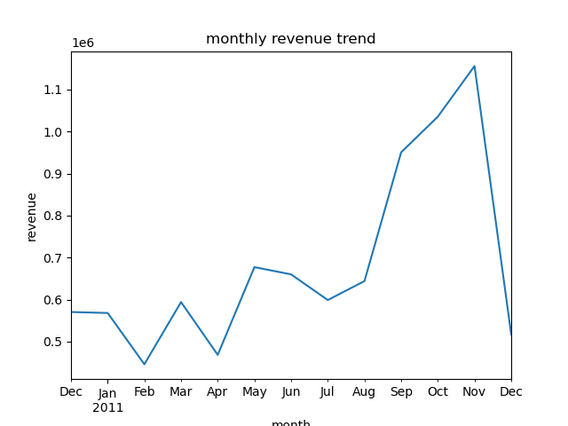
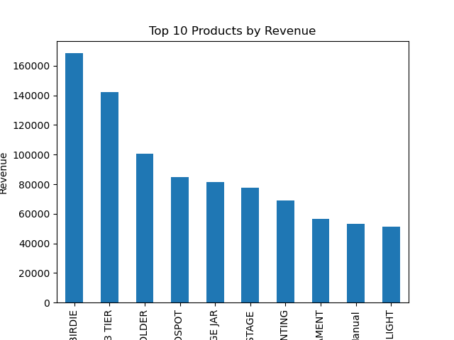
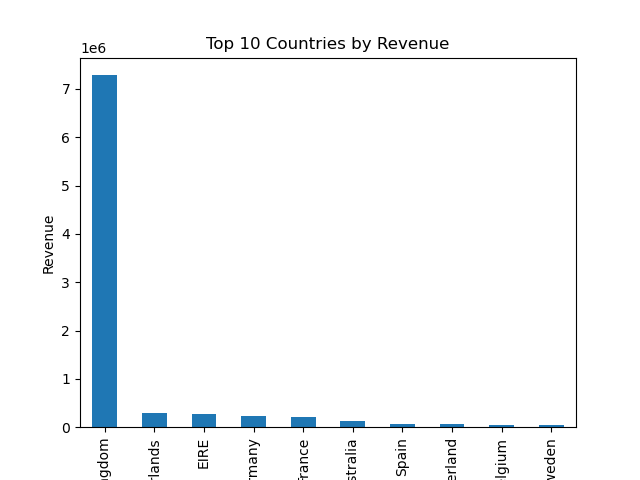

# RETAIL ANALYSIS: Online Retail Transactions

### PORTFOLIO HIGHLIGHTS

This project analyzes a real-world UK online retail dataset with over 500,000 transactions, revealing key sales trends, top products, and customer behavior.

Interactive visualizations show the relationship between quantity sold and total revenue, allowing a deeper understanding of product performance and actionable business insights.

### PROJECT OVERVIEW

- The goal of the project is to provide actionable business insights for increasing revenue, improving inventory, and optimizing marketing strategies.

- The end users should be able to identify: 
   -The monthly revenue and trends  
   -The top products by revenue and quantity, and both 
   -The peak sales
  

###   DATASET DESCRIPTION
- 541,909 transactions from a UK-based online retailer

- Columns: InvoiceNo, StockCode, Description, Quantity, InvoiceDate, UnitPrice, CustomerID, Country

- The data includes missing values, duplicate entries, returns, and Invoice cancellations 

 ### TOOLS USED
- python(pandas, Numpy)
- Matplotlib 
- plotyly
- jupyter Notebook
- excel

###  SKILLS APPLIED
- Data Cleaning & Handling Missing Data

- Feature Engineering (TotalPrice, YearMonth)

- Exploratory Data Analysis (Revenue Trends, Top Products, Top Customers, Revenue by Country)

- Data Visualization with Matplotlib / Pandas

- Interactive Visualization with Plotly

- Business Insights & Recommendations

###  CLEANING & PREPARATIONS

- Removed transactions with missing CustomerID or Description

- Filtered out cancellations (InvoiceNo starting with "C")

- Removed negative or zero Quantity and UnitPrice

- Dropped duplicate rows

-Created features:

   *TotalPrice = Quantity * UnitPrice

   *YearMonth = InvoiceDate (month-year for trend analysis)

### FINDINGS AND INSIGHTS 
    
- Revenue peaks in November, indicating strong seasonality likely due to holiday demand, black friday deals 

visualization: 

- PAPER CRAFT, LITTLE BIRDIE generates the highest revenue
visual: 

- United Kingdom contributes the most revenue making it the top country

visual: 

### RECOMMENDATIONS 

- Businesses can plan inventory and marketing campaigns around November.
- Focus on promotion, inventory planning, and product bundling on paper craft, little birdie.
- Focus retention campaigns in the UK and explore high-performing secondary markets

### INTERACTIVE REVENUE VS QUANTITY ANALYSIS

- Shows the relationship between total revenue and quantity sold per product.allowing deeper understanding of product performance 

- Hover over points to see product name, quantity, and revenue.

- Colors highlight top products by revenue, quantity, or both.

[Click here to view the interactive chart live](interactive/revenue_vs_quantity.html)

 ### HOW TO RUN THE PROJECT 

- Open the Jupyter Notebook (retail_analysis.ipynb)

- Ensure the dataset OnlineRetail.xlsx is in the data/ folder

- Run all cells to reproduce the analysis and visualizations

- Screenshots in this README correspond to the plots generated in the notebook

- Click the interactive chart link to explore product-level insights dynamically

**Project created by Ritah Kimani